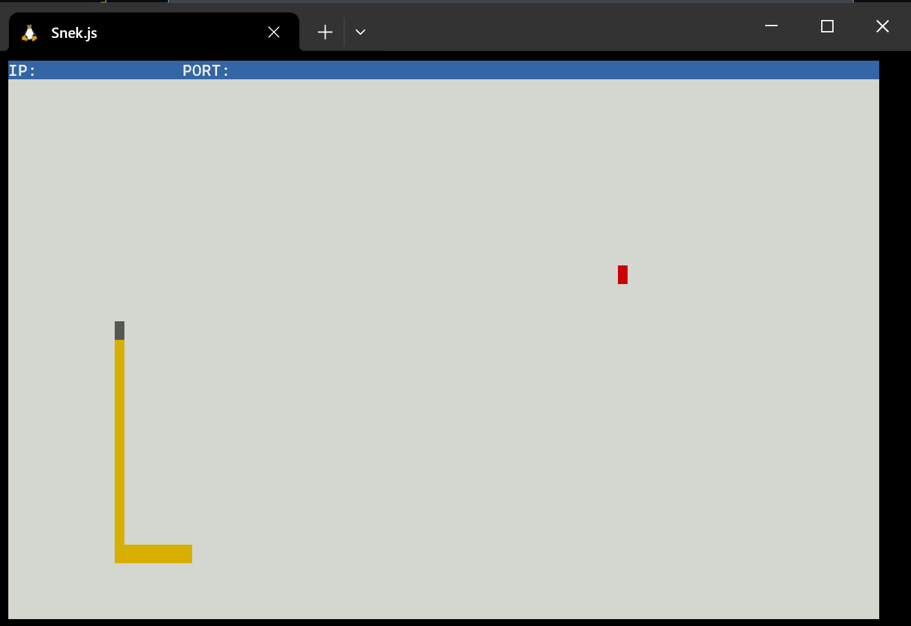
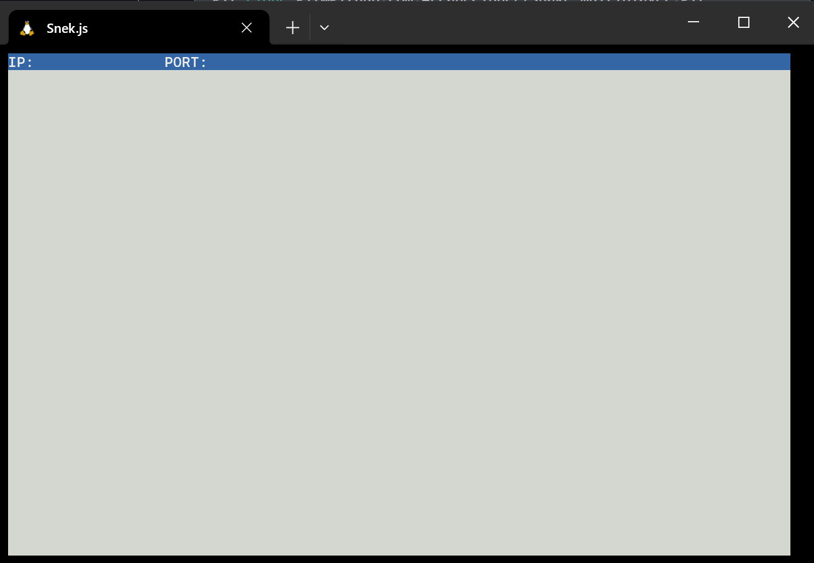
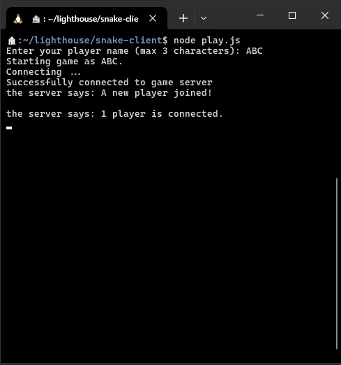

# Lighthouse Labs: Snake Client Project

### Note for Evaluator:

> I've included a readline input for the user when running node play.js. The client will be prompted to input their name for in game use. Enter any name between 1 to 3 characters. Accepted characters are a-z, A-Z, and 0-9.
>
> I completed the stretch activity and updated the RemoteInterface.js file in the forked [snake-multiplayer/src](https://github.com/ArcaneCipher/snake-multiplayer) directory

## Project Background

Snake game is a very popular video game. It is a video game concept where the player maneuvers a dot and grows it by ‘eating’ pieces of food. As it moves and eats, it grows and the growing snake becomes an obstacle to smooth maneuvers. The goal is to grow it to become as big as possible without bumping into the side walls, or bumping into itself, upon which it dies.

This is simply a multiplayer take on the genre.

Before you can run this client, you will need to be running the server side which you can download and install from [here](https://github.com/ArcaneCipher/snake-multiplayer).

The server version is a Fork of the LHL version of the game. The fork contains modifications to src/RemoteInterface.js to enable message broadcasting to clients.

## Final Product



## Getting Started

- To play the game, one needs to implement a game client. 
- Follow steps inside the [snek server](https://github.com/ArcaneCipher/snake-multiplayer) repo to run the server side.
- Run the development snake client using the `node play.js` command.

## Installation

### Server Side:
Clone from repository
```bash
git clone git@github.com:ArcaneCipher/snake-multiplayer.git
cd snake-multiplayer

# install and run via npm
npm install
npm run play
```



### Client Side: 
Clone from repository
```bash
git clone git@github.com:ArcaneCipher/snake-client.git
cd snake-client
node play.js
```

- The game will ask for your name.
- Name must be 1 to 3 characters.
- Accepted characters are a-z, A-Z, and 0-9.



## Acknowledgements

This project was not built from scratch. It was inspired and started from [snek](https://github.com/taniarascia/snek) ([blog post](https://www.taniarascia.com/snake-game-in-javascript/)). [Tania Rascia](https://www.taniarascia.com) is the original author.
